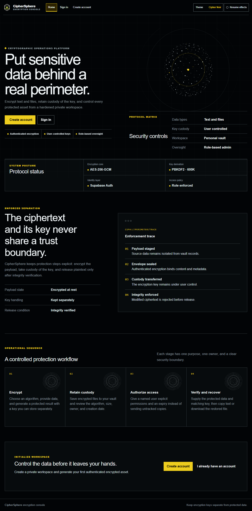
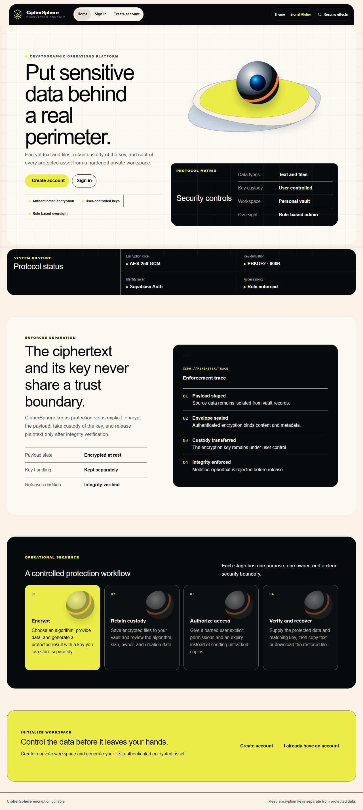
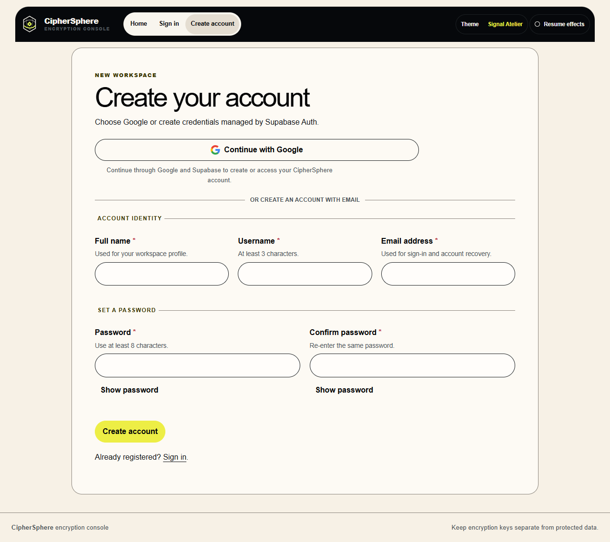

# CipherSphere

CipherSphere is a Flask security workspace for encrypting text and files, managing a private ciphertext vault, sharing ciphertext with named users, and administering access. Supabase provides Auth, PostgreSQL, and private object storage in production.

## Interface

CipherSphere has two complete visual systems—not a light/dark recolor—and a persistent theme switcher in the top-right navigation and Profile settings.

### Cipher Noir



### Signal Atelier



### Account creation



Both systems include responsive navigation, visible keyboard focus, semantic forms and tables, reduced-motion support, and a visible pause/resume control for persistent effects.

## Current features

- Supabase email/password registration, email confirmation, sign-in, recovery, and Google OAuth with PKCE.
- The first Supabase identity becomes the initial administrator; later identities become members.
- Optional private profile photos with verified image decoding, metadata stripping, square normalization, and size limits.
- Authenticated text and file encryption using the versioned CSPH v1 envelope.
- AES-256-GCM, authenticated Fernet, and hybrid RSA-OAEP/AES-256-GCM modes.
- Owner-scoped vault records, expiring shares, and single-use download tokens.
- Administrator views for users, encrypted-file metadata, activity, and service state.
- Local private storage for development and a private Supabase Storage backend for serverless production.
- Cipher Noir and Signal Atelier with animated switching, local persistence, and motion controls.

Encryption keys are returned to the user and are not stored in vault/share records. A lost key cannot be recovered by CipherSphere.

## Security controls

- Supabase owns passwords, confirmation, OAuth, and recovery tokens.
- Application tables use RLS with deny-by-default Data API access; server-side authorization still scopes every record operation.
- Flask-WTF CSRF protection, Jinja auto-escaping, parameterized SQLAlchemy queries, safe upload names, and owner/admin checks.
- CSP, HSTS in production, anti-clickjacking, MIME sniffing protection, referrer/permissions policies, and no-store caching for authenticated pages.
- Secure `__Host-` production cookies, strong session protection, session rotation after login, bounded form/request limits, and fail-closed production validation.
- Rate limits on registration, password login, Google OAuth, and account recovery. The built-in limiter is process-local defense in depth; use Vercel/Supabase platform rate controls for distributed enforcement.
- Atomic single-use download consumption prevents concurrent replay.
- Private Supabase Storage has no anonymous/authenticated object policy; only the server-only secret may access it.

The checked dependency set currently passes `pip-audit`, `pip check`, and Bandit without known dependency vulnerabilities or medium/high findings.

## Local development

Requirements:

- Python 3.12
- A Supabase project
- Supabase URL and publishable key

```powershell
python -m venv .venv
.venv\Scripts\Activate.ps1
pip install -r requirements.lock
Copy-Item .env.example .env
python app.py
```

Open `http://localhost:5000`.

For isolated local development, omit `DATABASE_URL` and leave `STORAGE_BACKEND=local`; CipherSphere uses ignored files under `instance/`. This SQLite/local-storage mode is not for deployment.

## Supabase setup

Apply every migration in `supabase/migrations/` in filename order (or link the Supabase CLI and run `supabase db push`). They create the application schema, Auth profile trigger, indexes, RLS controls, avatar field, and private `ciphersphere-private` Storage bucket.

Configure Auth:

1. Enable email/password authentication.
2. In Google Cloud, create a Web OAuth client and set its authorized redirect URI to `https://YOUR_PROJECT_REF.supabase.co/auth/v1/callback`.
3. In Supabase, open **Authentication → Sign In / Providers → Google**, then enter the Google client ID/secret and enable it.
4. For local development, set **Authentication → URL Configuration → Site URL** to `http://localhost:5000`.
5. Keep these local Redirect URLs:
   - `http://localhost:5000/auth/callback`
   - `http://localhost:5000/login`
   - `http://localhost:5000/reset_password`
6. Enable leaked-password protection under Auth attack/password protection when available on your plan.

Google credentials stay in Supabase. Do not place the Google client secret in this repository or browser code.

## Deploy to Vercel

Vercel detects the top-level Flask `app` in `app.py`; `.python-version` selects Python 3.12 and `vercel.json` configures the function duration/bundle exclusions.

1. Push this repository to GitHub, then import it in Vercel (or install the CLI and run `vercel`).
2. Connect the official **Supabase integration** to the Vercel project for Production and Preview. It supplies `POSTGRES_URL`, `SUPABASE_URL`, the publishable keys, and the server-only Supabase key. CipherSphere accepts those integration names directly.
3. In **Vercel → Project Settings → Environment Variables**, add the application settings below. Do not upload `.env`.

```dotenv
CIPHERSPHERE_ENV=production
SECRET_KEY=<stable random value of at least 32 characters>
AUTO_CREATE_DATABASE=false

AUTH_PROVIDER=supabase
STORAGE_BACKEND=supabase
SUPABASE_STORAGE_BUCKET=ciphersphere-private
MAX_CONTENT_LENGTH=4194304
AVATAR_MAX_BYTES=4194304

SESSION_COOKIE_SECURE=true
TRUST_PROXY_HEADERS=true
```

The integration's `POSTGRES_URL` uses Supabase’s transaction pooler for Vercel’s short-lived functions. `DATABASE_URL` remains available as an explicit override for other deployment providers. On Vercel, the app disables prepared statements and application-side connection pooling so Supavisor can manage connections.

CipherSphere derives trusted hosts and password/OAuth callback URLs from Vercel's deployment URL variables. Set explicit `TRUSTED_HOSTS`, `SUPABASE_PASSWORD_REDIRECT_URL`, or `SUPABASE_OAUTH_REDIRECT_URL` only when using a custom domain or overriding the production destination.

Vercel Functions currently limit request bodies to 4.5 MB, so the recommended application limit is 4 MiB. Larger encrypted-file workflows need direct-to-storage upload architecture or a non-serverless host.

4. Deploy once to receive the Vercel domain.
5. In Supabase URL Configuration:
   - Set **Site URL** to `https://YOUR_DOMAIN`.
   - Keep the localhost redirects for development.
   - Add `https://YOUR_DOMAIN/auth/callback`.
   - Add `https://YOUR_DOMAIN/login`.
   - Add `https://YOUR_DOMAIN/reset_password`.
   - Optional previews: add `https://*-YOUR_VERCEL_ACCOUNT.vercel.app/**` only if you need OAuth/email flows on preview deployments.
6. Redeploy after environment changes because they apply only to new deployments. Deploy from the Vercel dashboard or run `vercel --prod`.

Do not commit `SECRET_KEY`, `DATABASE_URL`, `SUPABASE_SECRET_KEY`, `.env`, local databases, uploads, or `.vercel` metadata. They are excluded by `.gitignore` and `.vercelignore`.

## Project structure

```text
app.py                         Flask/Vercel entry point
wsgi.py                        generic WSGI entry point
ciphersphere/
  __init__.py                  application factory
  auth_service.py              Supabase Auth adapter
  encryption.py                CSPH v1 cryptography
  security.py                  headers, validation, rate limits
  storage_service.py           local/private Supabase storage
  models.py                    SQLAlchemy records
  routes/                      auth, crypto, vault, sharing, profile, admin
  templates/                   semantic Jinja pages
  static/                      two-system UI, motion, logo
supabase/migrations/            PostgreSQL/RLS/Storage migrations
docs/screenshots/               current public product screenshots
```

See [DESIGN.md](DESIGN.md) for the visual systems and [PRODUCT.md](PRODUCT.md) for behavior and security invariants.
